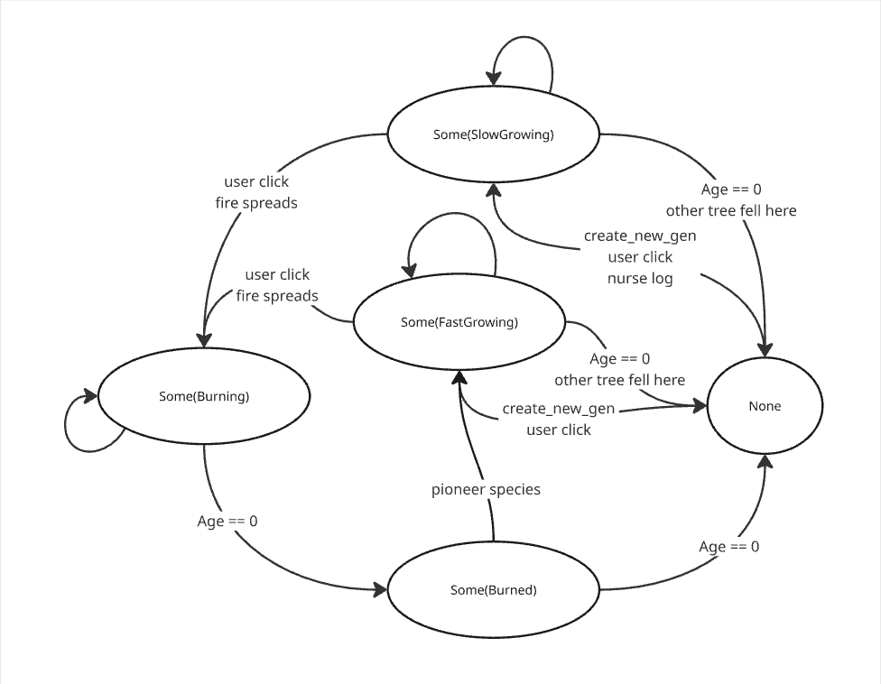

# MiniForestSimulator
This is a Rust program for simulating a very small subset of old growth forest behaviors.


## Run

```rust
cargo run
```

Initialize the game by placing 8 trees

    Left click to place a slow growing and longer living tree (Dark Green)
    Right click to place a fast growing but shorter living tree (Light Green)

The simulation will start after the 8th tree is placed

Once the simulator starts you can still interact

    Left click to place a slow growing and longer living tree (Dark Green)
    Right click to place a fast growing but shorter living tree (Light Green)
    Middle click to start a burn (Orange)

## Features

- Trees will create new genereation each turn

    - Slow growing trees will create up to 1 new tree per turn and only spread within 6 tiles

    - Fast growing trees will create up to 3 new trees per turn and spread within 10 tiles

- Trees will eventually get too old, "fall", and be removed from the board

    - When a slow growing tree falls it will clear a line of other trees

        - Some of the cleared cells will randomly start a new slow growing tree

- Users can start a fire

    - Fire will spread and burn for 5 turns 
        
        - Fires will spread toward cells that are "burnable" i.e. trees.

        - Fires will spread no more than 1 tile per turn

    - After the fire dies all of the burning cells turn to a burned state for 1 turn

    - After the tiles are burned, cells will either become empty or start a new fast growing tree


## Known Bugs

None that I know of presently

## Design Notes

<p>
My initial design contained a Vec of Trees that included a board position. This design required iterating through all the trees to remove trees, update states, add trees, and really any operation on the board state. I quickly found this to be severely limiting when I got to the stage of adding fires. I decided then to do some redesiging and refactoring of the state management and found the following solution used presently.

Track the state in a 2D array of Optional BoardCell. Therefore, an empty cell is None, and an occupied cell is Some(BoardCell) where the BoardCell contains the state. This allows the entire board to be accessed directly via the index, and doesn't require iterating through an entire list of trees. This was enabled by the fact that the board size is known so a 2D array can be used with that known size.

This data structure refactor enabled the simulation design to simply iterate through the board to track state changes, iterate through a few small sets of state changes, and iterate through the board one more time to display it.

The state changes are applied via the rules of this machine:



</p>

## Vision

<p>

1. Mixed Ages

This is accomplished via the BoardCell tracking age and the create_new_gen implementation. A BoardCell having a slow or fast growing tree state will enable it to create new trees that are younger and outlive the tree currently in the cell. This produces mixed ages and a cycle of trees sprouting and dying.

This is also accomplished via another key feature internal to the state algorithm. One is the death of a slow growing tree randomly producing new slow growing trees where it fell i.e. nurse logs.


2. Mixed Species

This is accomplished by the TreeState enum having both FastGrowing and SlowGrowing values. This is what differentiates the species. These two different species will act differently in the simulator both in how quickly they multiply and how far they reach. 

This is also accomplished by fires that leave behind a cleared area where fast growing trees will quickly move into i.e. pioneer species

3. Management

As the vision outlines, this is up to the user. The user has the power to choose when and where to burn. It is an active choice to participate in the simulation enabled by the middle click to start a fire.

</p>

## Addressing Concerns

<p>
My primary concern when starting this project was finding a compelling way to display the simulation. I tackled that first and found macroquad (see Acknowledgments) to be both easy to use and exactly what I needed to easily display the kind of information the simulator produces.</p>

## Acknowledgments
Used the following text for learning rust

*Programming Rust: Fast, Safe Systems Development
Jim Blandy and Jason Orendorff
2nd edition, O'Reilly 2021*

Thank you to Bart Massey who instructed a Rust Programming course and provided feedback on my design

Using macroquad game engine
referenced https://macroquad.rs/examples/ snake.rs as a starting point

## License 

See attached MIT License